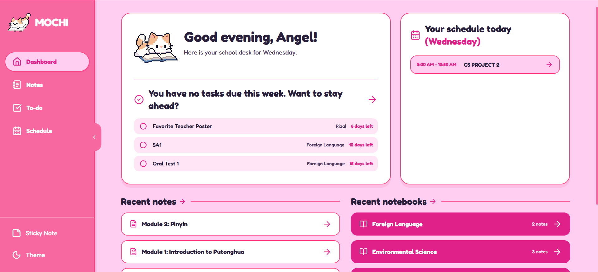

# Mochi — Your Personal School Secretary

Mochi is a cute, student-focused school productivity app that helps organize notes, tasks, schedules, study plans, flashcards, and AI-assisted study materials in one local workspace.

The project is built around a soft pink pixel-style interface and a study workflow designed for students who want a friendlier way to manage schoolwork.



## Features

- **Dashboard** — quick overview of upcoming tasks, recent notes, subjects, and today’s schedule.
- **Notes workspace** — notebook/module organization with a rich text editor powered by Tiptap.
- **AI study tools** — Gemini-assisted note generation, primers, reviewers, quizzes, and flashcards.
- **To-do manager** — task tracking with priority suggestions, days-left labels, filters, and completion states.
- **Schedule planner** — weekly class schedule view with export/edit flows.
- **Study plans** — structured plans for exams and review sessions.
- **Sticky notes** — lightweight notes for quick reminders.
- **Mochi UI system** — custom pink/purple palette, rounded components, pixel mascot assets, and student-friendly layout patterns.

## Tech Stack

- **React 19**
- **Vite**
- **React Router**
- **Zustand**
- **Dexie / IndexedDB**
- **Tiptap editor**
- **Gemini API**
- **Tailwind CSS**
- **Lucide React icons**
- **date-fns**

## Project Structure

```text
.
├── mochi/                 # Main React + Vite app
│   ├── src/
│   │   ├── app/           # App shell and store
│   │   ├── features/      # Dashboard, notes, schedule, todo, etc.
│   │   ├── shared/        # Shared utilities and libraries
│   │   └── components/    # Shared UI components
│   └── package.json
├── skills/                # Local Codex skills and project instructions
└── ui-revamp/             # UI references, assets, fonts, and prompt docs
```

## Getting Started

Clone the repository and install dependencies from the app directory:

```bash
git clone https://github.com/your-username/Mochi-Your-Personal-School-Secretary.git
cd Mochi-Your-Personal-School-Secretary/mochi
npm install
```

Create a local environment file:

```bash
cp .env.example .env
```

If `.env.example` does not exist yet, create `.env` manually:

```env
VITE_GEMINI_KEY=your_gemini_api_key_here
```

Then start the development server:

```bash
npm run dev
```

## Available Scripts

Run these from the `mochi/` directory:

```bash
npm run dev
npm run build
npm run preview
npm run lint
```

## AI Features

Mochi uses Gemini for study-related generation, including:

- cleaned study notes
- short-form and long-form notes
- primers
- reviewers
- quizzes
- flashcards
- schedule parsing
- study plan generation
- task priority suggestions

Mochi is intended to run locally. Add your own Gemini API key in a local `.env` file to use AI features.

## Local-First Note

Mochi is not deployed as a public hosted demo. It is designed to be cloned and run locally so each user can provide their own Gemini API key and keep API usage under their control.

## Design Direction

Mochi’s interface uses a soft, playful school-secretary style:

- primary pink: `#f768a0`
- soft pink: `#ffcef0`
- hot pink: `#f9447f`
- deep pink: `#e02189`
- dark purple text: `#29213c`
- white: `#ffffff`
- purple accent: `#cb6ce6`

The UI revamp references and mascot assets live in `ui-revamp/`.

## Status

Mochi is actively being developed and refined as a local student productivity project.
